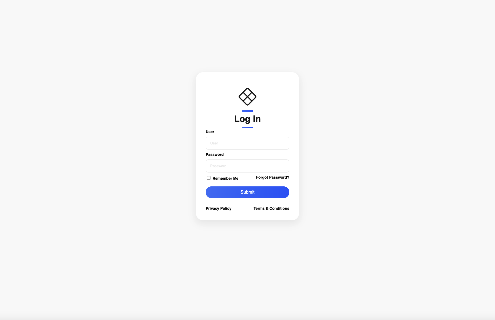
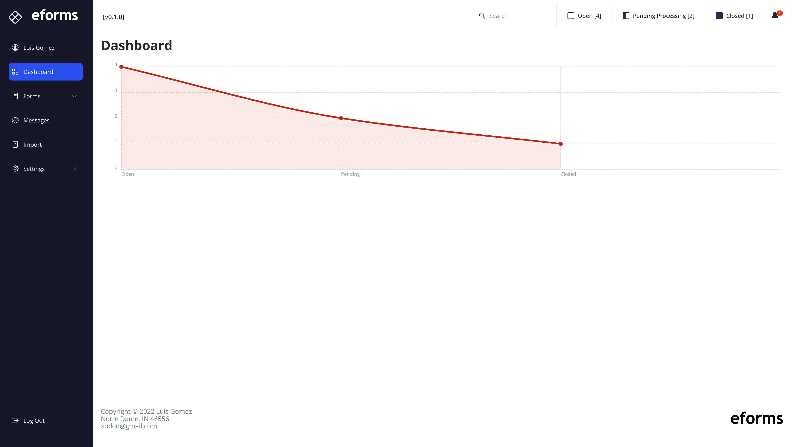
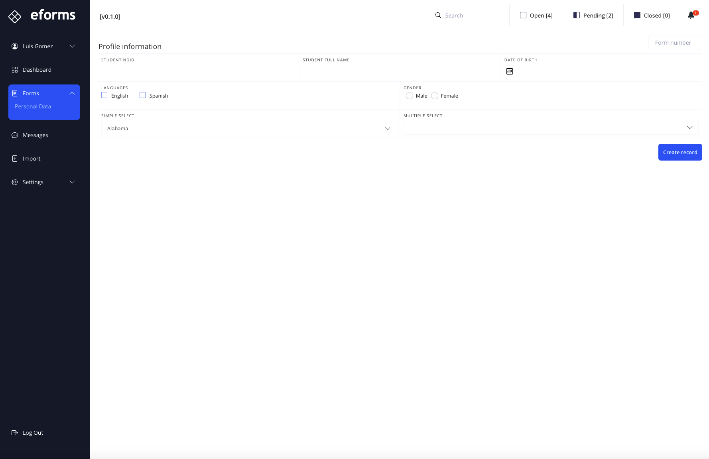
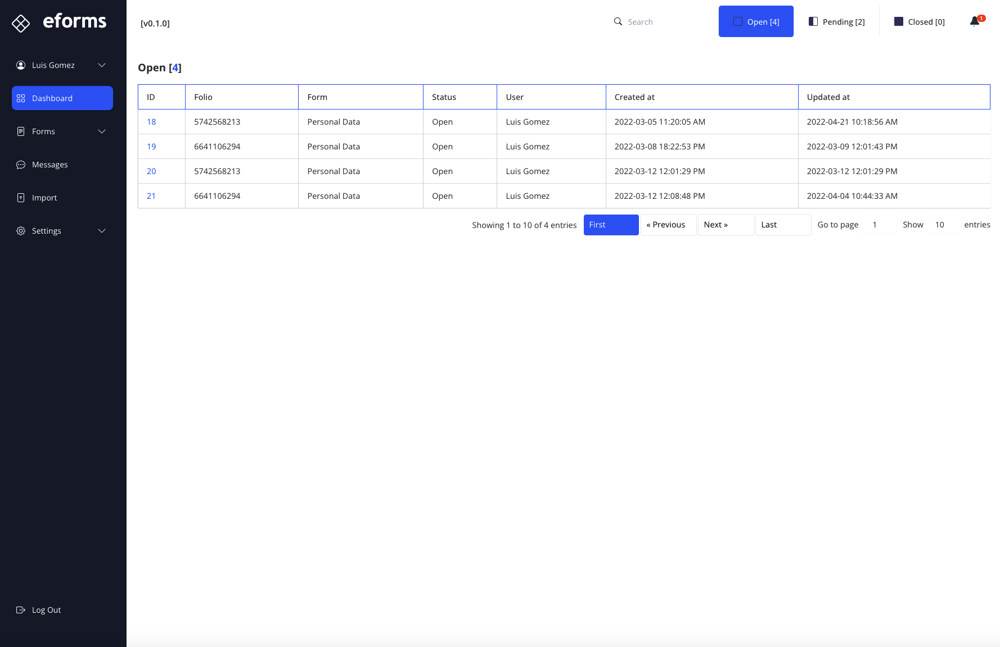
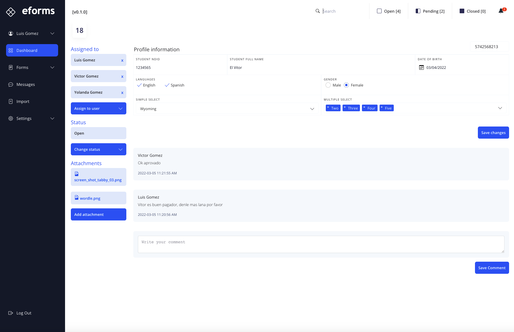
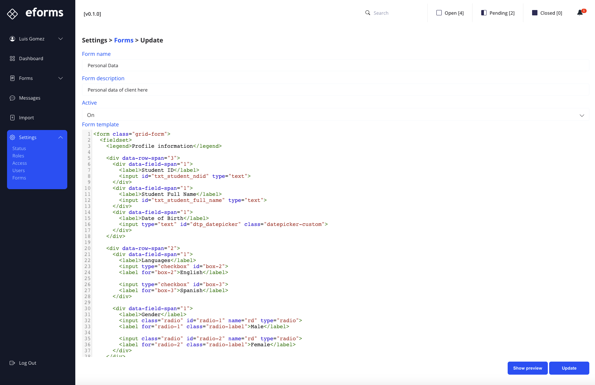

# eforms

Simple forms creation and follow ups

https://eforms.mischicanadas.com
<br>
User: lgomez
Pass: lgomez

## Installation

```crystal
crystal build src/eforms.cr --release
```

## Usage

Default values in `.env` file
`PUBLIC_PATH`   where the default folder will be with the application assets.
`PORT`          application port number.
`DATABASE_PATH` where the application SQLite database is stored.

ENV
```bash
PUBLIC_PATH=/Users/luis/Dropbox/Code/Crystal/apps/eforms/public
DATABASE_PATH=/Users/luis/Dropbox/Code/Crystal/apps/eforms/db/eforms.db
PORT=3000
```

## Screenshots

Login page



Dashboard



New eForm



Open eForms



eForm details



eForm update / creation



## Development

1. Refactor dashboard
2. Import `csv` file

## Contributing

1. Fork it (<https://github.com/xtokio/eforms/fork>)
2. Create your feature branch (`git checkout -b my-new-feature`)
3. Commit your changes (`git commit -am 'Add some feature'`)
4. Push to the branch (`git push origin my-new-feature`)
5. Create a new Pull Request

## Contributors

- [Luis Gomez](https://github.com/xtokio) - creator and maintainer
